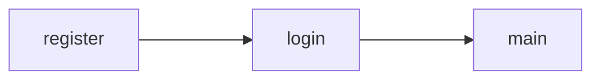

# Simple ATM Simulator

Simple ATM Simulator adalah program bahasa C yang mensimulasikan interaksi antara pengguna dengan mesin ATM yang dirancang oleh yours truly, NOTGEH FOUNDATION untuk memenuhi tugas projek Lab Pemrograman Kelas B 2022.


## Requirements

 - Windows machine atau Windows 365
 - gcc atau compiler C alternatif lainnya
 - Visual Studio Code (opsional)


## Getting Started

Mulai dengan cloning github repository ke laptop/PC agar bisa menggunakan program secara lokal dengan menggunakan command berikut di terminal

  ```
  git clone https://github.com/neocet/simple-atm-simulator
  ```


## Workflow
Projek ini memiliki workflow sebagai berikut:



### Starting with Register
Program register akan menulis data username dan password ke suatu file biner agar program login bisa mengautentikasi user yang sedang mencoba untuk menggunakan program ini.
Compile source code dengan menggunakan gcc kemudian dijalankan
```
gcc -o register register.c
./register
```

Setelah file register dijalankan maka akan muncul file baru "login.bin" yang berisi username dan password.
<details>
  <summary>Show credentials (Spoiler Alert!)</summary>
  
```
username: NOTGEH
password: root
```
</details>


### Logging In
Compile file login
```
gcc -o login login.c
```

Untuk menggunakan file login, user harus menambahkan argumen pada saat menjalankan file tersebut. Argumen yang diinput merupakan username dan password.
```
./login <username> <password>
```

Gunakan flag `-h` atau `--help` untuk bantuan lebih lanjut.
```
./login --help
```

### Running the Program
Compile source code program main
```
gcc -o main main.c
```
Lalu jalankan programnya
```
./main
```


## Credits
**NOTGEH FOUNDATION**

 - [Margfirah](https://github.com/margfiraa)
 - [Teuku Beuraja Laksamana](https://github.com/neocet)
 - [Nitiya Rihadatul `Aisy](https://github.com/Nitiya05)
 - [Tasya Nadilla](https://github.com/Tasyanadila)
 - [Teuku Rifal Aulia](https://github.com/rifal-droid)
